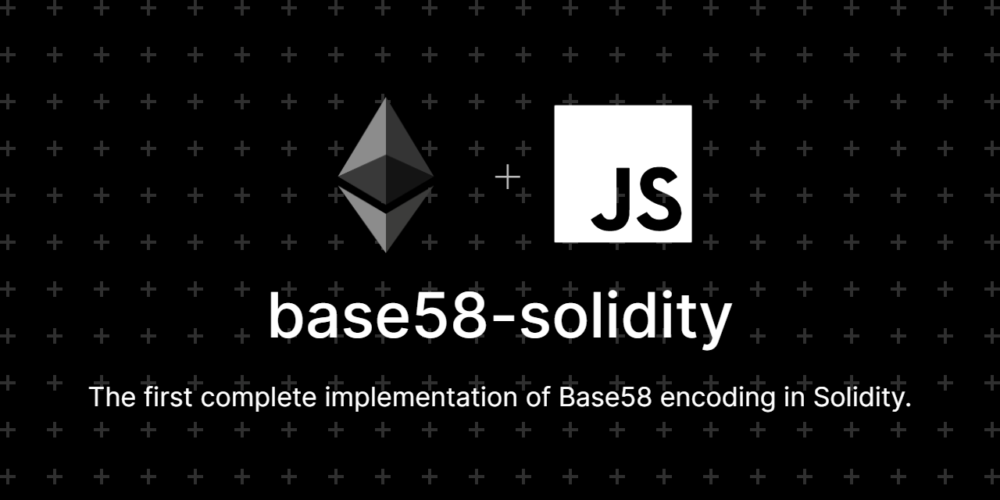

# Base58 Solidity

The first complete implementation of Base58 encoding in Solidity.

## Contribution

Thank you for considering to help out with the source code! Welcome contributions
from anyone on the internet, and are grateful for even the smallest of fixes!

If you'd like to contribute to this project, please fork, fix, commit and send a pull request
for me to review and merge into the main code base.